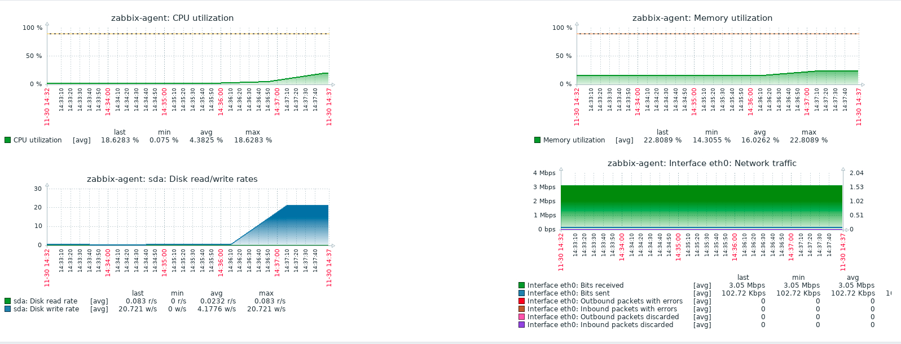

## Стенд для занития для мониторинга и алертинга.

Цель:

Настроить дашборд с 4-мя графиками
1) память
2) процессор
3) диск
4) сеть

настроить на одной из систем
- zabbix (использовать screen (комплексный экран))
- prometheus - grafana

### 1. Установка веб-сервера

#### 1.1. Установим web-сервер Nginx
```
[root@zabbix-server ~]# yum install -y http://nginx.org/packages/centos/7/noarch/RPMS/nginx-release-centos-7-0.el7.ngx.noarch.rpm
[root@zabbix-server ~]# yum install -y nginx
[root@zabbix-server ~]# systemctl enable --now nginx
```

#### 1.2. Установка PHP
```
[root@zabbix-server ~]# yum install -y install epel-release yum-utils
[root@zabbix-server ~]# yum install -y http://rpms.remirepo.net/enterprise/remi-release-7.rpm
[root@zabbix-server ~]# yum install -y php72 php-fpm php-cli php-mysql php-gd php-ldap php-odbc php-pdo php-pecl-memcache php-pear php-xml php-xmlrpc php-mbstring php-snmp php-soap php-bcmath
[root@zabbix-server ~]# systemctl enable --now php-fpm
```
Настроим работу php-fpm через unix сокет. 

Редактируем файл конфигурации `/etc/php-fpm.d/www.conf`
```
[root@zabbix-server ~]# mv /etc/php-fpm.d/www.conf /etc/php-fpm.d/www.conf.bak
[root@zabbix-server ~]# vi /etc/php-fpm.d/www.conf
```
```
[www]
user = nginx
group = nginx

;listen = 127.0.0.1:9000
listen = /var/run/php-fpm/php-fpm.sock
listen.mode = 0660
listen.owner = nginx
listen.group = nginx

listen.allowed_clients = 127.0.0.1

pm = dynamic
pm.max_children = 50
pm.start_servers = 5
pm.min_spare_servers = 5
pm.max_spare_servers = 35

slowlog = /var/log/php-fpm/www-slow.log
php_admin_value[error_log] = /var/log/php-fpm/www-error.log
php_admin_flag[log_errors] = on
php_value[session.save_handler] = files
php_value[session.save_path]    = /var/lib/php/session
php_value[soap.wsdl_cache_dir]  = /var/lib/php/wsdlcache
```

Перезапускаем php-fpm:
```
[root@zabbix-server ~]# systemctl restart php-fpm
```
Проверяем работу сокета:
```
[root@zabbix-server ~]# ll /var/run/php-fpm/php-fpm.sock
srw-rw---- 1 nginx nginx 0 Nov 16 13:34 /var/run/php-fpm/php-fpm.sock
```

#### 1.3. Установка MariaDB
Установка базы данных MariaDB
```
[root@zabbix-server ~]# yum install -y mariadb mariadb-server MySQL-python
[root@zabbix-server ~]# systemctl enable --now mariadb
```
Запустип скрипт для начальной настройки mysql
```
[root@zabbix-server ~]# mysql_secure_installation
```
password mariadb: password

### 2. Установка Zabbix

#### 2.1. Установка Zabbix сервера

```
[root@zabbix-server ~]# yum install -y https://repo.zabbix.com/zabbix/4.4/rhel/7/x86_64/zabbix-release-4.4-1.el7.noarch.rpm
[root@zabbix-server ~]# yum install -y zabbix-agent zabbix-server-mysql zabbix-web-mysql
```

#### 2.2. Создание базы данных для Zabbix сервера

```
[root@zabbix-server ~]# mysql -uroot -ppassword
```
```
MariaDB [(none)]> CREATE DATABASE zabbix CHARACTER SET utf8 COLLATE utf8_bin;
MariaDB [(none)]> CREATE USER zabbix@localhost IDENTIFIED BY 'zabbix';
MariaDB [(none)]> GRANT ALL PRIVILEGES ON zabbix.* TO zabbix@localhost;
MariaDB [(none)]> \q
```

#### 2.3. Заполнение базы данных необходимыми параметрами 

```
zcat /usr/share/doc/zabbix-server-mysql*/create.sql.gz | mysql -uzabbix -p zabbix
```
Редактируем файл конфигурации сервера Zabbix. 

```
[root@zabbix-server ~]# vi /etc/zabbix/zabbix_server.conf
```
```
DBHost=localhost
DBName=zabbix
DBUser=zabbix
DBPassword=zabbix
ListenIP=0.0.0.0
Timeout=10
```
Запускаем zabbix и добавляем в автозагрузку
```
[root@zabbix-server ~]# systemctl enable --now zabbix-server
```

#### 2.4. Настройка Nginx

```
[root@zabbix-server ~]# mv /etc/nginx/conf.d/default.conf /etc/nginx/conf.d/default.conf.bak
[root@zabbix-server ~]# vi /etc/nginx/conf.d/default.conf
```

```
server {
    listen       80;
    server_name  zabbix.sevo44.loc;
    root /usr/share/zabbix;

    location / {
    index index.php index.html index.htm;
    }

    location ~ \.php$ {
    fastcgi_pass unix:/var/run/php-fpm/php-fpm.sock;
    fastcgi_index index.php;
    fastcgi_param SCRIPT_FILENAME  $document_root$fastcgi_script_name;
    include fastcgi_params;
    fastcgi_param PHP_VALUE "
    max_execution_time = 300
    memory_limit = 128M
    post_max_size = 16M
    upload_max_filesize = 2M
    max_input_time = 300
    date.timezone = Europe/Moscow
    always_populate_raw_post_data = -1
    ";
    fastcgi_buffers 8 256k;
    fastcgi_buffer_size 128k;
    fastcgi_intercept_errors on;
    fastcgi_busy_buffers_size 256k;
    fastcgi_temp_file_write_size 256k;
        }
}
```
Проверим конфиг на ошибки.
```
[root@zabbix-server ~]# nginx -t
```
Перезапустим nginx
```
[root@zabbix-server ~]# systemctl restart nginx
```
Настройка Zabbix для работы с Nginx
```
[root@zabbix-server ~]# chown -R root:nginx /var/lib/php/session
[root@zabbix-server ~]# chown -R nginx:nginx /etc/zabbix/web
```

#### 2.5. SELinux

Из лога `audit.log` создадим разрешающий модуль для zabbix:

```
[root@zabbix-server ~]# cat /var/log/audit/audit.log  | grep zabbix | audit2allow -M zabbix
```
```
******************** IMPORTANT ***********************
To make this policy package active, execute:

semodule -i zabbix.pp
```
Устанавливаем модуль
```
[root@zabbix-server ~]# semodule -i zabbix.pp
```

```
[root@zabbix-server ~]# cat /var/log/audit/audit.log  | grep zabbix_server | audit2allow -M zabbix_server
```


Создадим разрешающий модуль для php-fpm
```
[root@zabbix-server ~]# cat /var/log/audit/audit.log  | grep php-fpm | audit2allow -M php-fpm
```
```
******************** IMPORTANT ***********************
To make this policy package active, execute:

semodule -i php-fpm.pp
```

Устанавливаем модуль
```
[root@zabbix-server ~]# semodule -i semodule -i php-fpm.pp
```

#### 2.6. Установка Zabbix адент

Установим на второй хост zabbix agent.

```
[root@zabbix-agent ~]# yum install -y https://repo.zabbix.com/zabbix/4.4/rhel/7/x86_64/zabbix-release-4.4-1.el7.noarch.rpm
[root@zabbix-agent ~]# yum install -y zabbix-agent
```

Редактируем файл конфигурации агента /etc/zabbix/zabbix_agentd.conf

```
Server=192.168.11.150
ListenPort=10050
ListenIP=192.168.11.160
ServerActive=192.168.11.150
Hostname=monagent
```

Запускаем zabbix и добавляем в автозагрузку
```
[root@zabbix-agent ~]# systemctl enable --now zabbix-agent
```

Открываем браузер, переходим [Zabbix](http://192.168.11.150/) в панели zabbix на серере zabbix server добавляем хост zabbix agent.



Ссылка на дополнительную информацию
- [Установка Zabbix](https://sevo44.ru/ustanovka-zabbix-4-2/)
